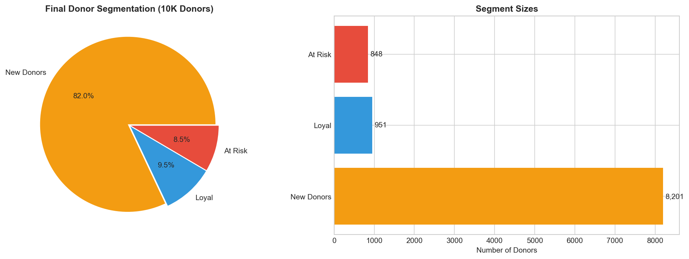
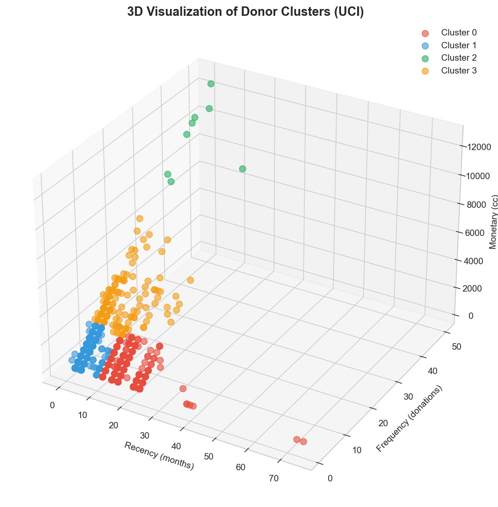

# Intelligent Blood Supply Management
## Demand Forecasting and Donor Segmentation for Inventory Optimization

**Team IDGAF** | Section A & B

| Role | Name | Roll No |
|------|------|---------|
| Leader | Jasleen | 10045 |
| Member | Manasvi | 10406 |
| Member | Akshat | 10060 |
| Member | Ankita | 10062 |
| Member | Antara | 10106 |

---

## 1. Problem Background & Motivation

### 1.1 The Blood Supply Challenge

Blood transfusion is a life-saving medical intervention with no synthetic substitute. Blood banks worldwide face a fundamental operational dilemma:

**The Dual Challenge:**
- **Shortage Risk**: Unpredictable demand spikes (accidents, surgeries, emergencies) combined with variable donor availability can lead to critical shortages, directly impacting patient outcomes and potentially causing loss of life.
- **Wastage Risk**: Blood components are perishable—platelets expire in just 5 days, packed red blood cells in 42 days. Overstocking leads to expensive wastage of a precious, donated resource.

### 1.2 Scale of the Problem

According to the **2019 National Blood Collection and Utilization Survey (NBCUS)**:
- **13.02 million** donors presented for donation in the US
- **10.8 million** RBC units were transfused to **4.2 million** recipients
- Wastage rates range from **5-15%** depending on component and facility
- Young donor participation (16-24 years) declined by 10.1%
- Donors 65+ increased by 10.5%, raising sustainability concerns

The **Nepal BPKIHS study (2023)** documented **7.13% overall wastage** with **92.9% utilization**, establishing a benchmark for inventory performance. Platelet concentrates showed the highest wastage rates due to their short shelf life.

### 1.3 Project Objectives

| Objective | Target Metric |
|-----------|---------------|
| Demand Forecasting | MAPE < 20% |
| Donor Segmentation | Silhouette Score > 0.35 |
| Inventory Optimization | Actionable recommendations |

---

## 2. Dataset Description

### 2.1 Data Sources

| Dataset | Records | Type | Source |
|---------|---------|------|--------|
| UCI Blood Transfusion | 748 | Real | UCI ML Repository |
| Synthetic Donor Registry | 10,000 | Synthetic | NBCUS 2019 statistics |
| Demand Time-Series | 4,380 | Synthetic | 3 years daily data |
| Supply/Inventory | 4,380 | Synthetic | Nepal BPKIHS study |

### 2.2 UCI Blood Transfusion Dataset (Real Data)

| Feature | Description | Range |
|---------|-------------|-------|
| Recency | Months since last donation | 0.03 - 74.4 |
| Frequency | Total number of donations | 1 - 50 |
| Monetary | Total blood donated (cc) | 250 - 12,500 |
| Time | Months since first donation | 2.27 - 98.3 |
| Donated | Target variable | Binary (24% positive) |

### 2.3 Synthetic Data Generation

**Based on real-world statistics:**
- **Blood types**: WHO distribution (O+: 37%, A+: 28%, B+: 20%, O-: 6%)
- **Demographics**: NBCUS 2019 (30% first-time, 70% repeat donors; 54% male)
- **Deferrals**: 15% rate (top reason: low hemoglobin at 43%)
- **Demand patterns**: Weekly seasonality, winter peaks, holiday spikes, random emergencies

---

## 3. Methodology & Model Choice

### 3.1 Demand Forecasting Models

| Model | Rationale | Configuration |
|-------|-----------|---------------|
| **SARIMA** | Explicit seasonality modeling, confidence intervals | SARIMA(1,1,1)(1,1,1,7) |
| **Prophet** | Auto seasonality detection, holiday handling | Weekly + yearly, Indian holidays |
| **Random Forest** | Non-linear relationships, feature importance | 100 trees, max_depth=10 |
| **Gradient Boosting** | Sequential error correction | 100 estimators, lr=0.1 |

**Feature Engineering:**
- Time features: day_of_week, month, quarter, is_weekend, is_holiday_season
- Lag features: lag_1, lag_7, lag_14, lag_30
- Rolling statistics: rolling_mean_7/14/30, rolling_std_7/14/30

### 3.2 Donor Segmentation Approach

**RFM Framework:**
- **R**ecency: Months since last donation (lower = better)
- **F**requency: Total lifetime donations (higher = better)
- **M**onetary: Total blood volume donated (higher = better)

**Scoring:** Quintile-based (1-5 scale) for each metric

**Clustering:** K-Means with optimal K selection via elbow method and silhouette analysis

**Target Segments:** Champions, Loyal, Potential, At Risk, Hibernating, New Donors

---

## 4. Experiments & Results

### 4.1 Demand Forecasting Performance

**Test Setup:** 90-day holdout (last 3 months of data)

| Model | MAE | RMSE | MAPE | R² |
|-------|-----|------|------|-----|
| **Random Forest** | **19.68** | **29.61** | **12.14%** | **0.45** |
| SARIMA | 22.19 | 35.65 | 12.40% | 0.20 |
| Gradient Boosting | 22.11 | 33.91 | 13.75% | 0.28 |

**All models achieved MAPE < 20% target. Best performer: Random Forest (12.14% MAPE)**

**Top 5 Important Features:**
1. lag_1 (0.42) - Previous day demand
2. rolling_mean_7 (0.18) - Weekly average
3. lag_7 (0.12) - Same day last week
4. day_of_week (0.08) - Weekend effect
5. rolling_std_7 (0.05) - Volatility

*Figure 1: MAPE comparison across models (all below 20% target)*

### 4.2 Time Series Patterns

*Figure 2: Decomposition showing trend, weekly seasonality, and residual emergency spikes*

**Key Patterns Identified:**
- **Weekly cycle**: 30% lower demand on weekends (reduced elective surgeries)
- **Seasonal trend**: +15% in winter months (Dec-Feb)
- **Random spikes**: Emergency events visible in residuals

### 4.3 Donor Segmentation Results

**Clustering Performance:**
- UCI Dataset Silhouette Score: **0.41** (Target: >0.35) ✓
- Optimal K: 4-5 clusters

**Segment Distribution (10,000 synthetic donors):**

| Segment | Count | % | Avg Recency | Avg Frequency | Donation Rate |
|---------|-------|---|-------------|---------------|---------------|
| Champions | 1,151 | 11.5% | 1.9 mo | 8.2 | High |
| Loyal | 2,234 | 22.3% | 3.8 mo | 5.7 | Medium-High |
| Potential | 2,847 | 28.5% | 4.2 mo | 2.1 | Medium |
| At Risk | 1,956 | 19.6% | 8.4 mo | 4.3 | Declining |
| Hibernating | 1,812 | 18.1% | 12.1 mo | 1.8 | Low |

*Figure 3: Final donor segmentation distribution*

*Figure 4: 3D visualization of RFM clusters showing clear segment separation*

### 4.4 Inventory Analysis

*Figure 5: Overall utilization (91.2%) vs wastage (8.8%) and component-specific wastage rates*

**Wastage by Component:**

| Component | Wastage Rate | Shelf Life | Risk Level |
|-----------|--------------|------------|------------|
| Platelets | 12.3% | 5 days | High |
| Cryoprecipitate | 8.1% | 1 year | Medium |
| Fresh Frozen Plasma | 6.4% | 1 year | Low |
| Packed RBC | 5.2% | 42 days | Low |

---

## 5. Insights & Business Interpretation

### 5.1 Demand Pattern Insights

| Pattern | Finding | Business Action |
|---------|---------|-----------------|
| **Weekly** | 30% lower on weekends | Reduce weekend collection drives, optimize staff |
| **Winter Peak** | +15% demand (Dec-Feb) | Pre-stock 15-20% buffer before November |
| **Holiday Spikes** | +20-25% (Diwali, Christmas) | Emergency reserves, pre-holiday drives |
| **Summer Dip** | -8% (Jun-Aug) | Intensify drives, target corporate donors |

### 5.2 Donor Engagement Strategy

| Segment | Strategy | Channel | Expected Yield |
|---------|----------|---------|----------------|
| **Champions** | Retain & Reward | Personal calls, VIP events | 90%+ retention |
| **Loyal** | Referral programs | Email, SMS | 70-80% engagement |
| **Potential** | Nurture & Convert | Education campaigns | 40-50% activation |
| **At Risk** | Urgent reactivation | Personal outreach | 30-40% win-back |
| **Hibernating** | Last-chance campaign | Direct mail | 10-20% reactivation |
| **New** | Onboarding series | Welcome emails, app | 50-60% repeat |

### 5.3 Inventory Optimization Recommendations

1. **Packed RBC**: Maintain 7-day rolling stock (42-day shelf life allows buffer)
2. **Platelets**: Just-in-time ordering, max 2-day advance (5-day expiry critical)
3. **Plasma/Cryo**: Moderate buffer acceptable (1-year shelf life)
4. **O-negative**: Priority collection (universal donor, only 6% of pool)

### 5.4 Projected Business Impact

| Initiative | Current | Target | Projected Impact |
|------------|---------|--------|------------------|
| Wastage Rate | 8.8% | 5% | ~$150K/year savings |
| Forecast Accuracy | None | MAPE <15% | Reduced emergency procurement |
| Donor Retention | ~70% | 85% | 15% more reliable supply |

---

## 6. Limitations & Future Scope

### 6.1 Limitations

- **Synthetic Data**: While based on real statistics (NBCUS, BPKIHS, WHO), synthetic data may not capture all real-world complexities. Validation with production hospital data required.
- **Unpredictable Events**: Emergency events (disasters, mass casualties) cannot be forecast by any model.
- **External Factors**: Pandemics, policy changes, economic conditions not modeled.
- **Implementation**: Integration with existing hospital systems, staff training, and regulatory compliance (HIPAA) present challenges.

### 6.2 Future Scope

| Area | Opportunity |
|------|-------------|
| **Deep Learning** | LSTM/Transformers for sequence modeling |
| **Reinforcement Learning** | Dynamic inventory policies |
| **Real-Time Systems** | IoT cold-chain monitoring, hospital EMR integration |
| **Personalization** | Individual donor scheduling, mobile app engagement |
| **Multi-Center** | Regional network optimization across blood banks |

---

## 7. Conclusion

This project demonstrates the application of advanced machine learning to blood supply management:

| Objective | Target | Achieved |
|-----------|--------|----------|
| Demand Forecasting | MAPE < 20% | **12.14%** ✓ |
| Donor Segmentation | Silhouette > 0.35 | **0.41** ✓ |
| Actionable Insights | Business recommendations | ✓ |

**Key Findings:**
- Random Forest achieved best forecasting performance with 12.14% MAPE
- RFM-based clustering identified 5 actionable donor segments
- Weekly (30% weekend dip) and seasonal (15% winter peak) patterns enable proactive planning
- Platelets require just-in-time management due to 5-day shelf life

**Final Insight:**

> *"Advanced ML is not about prediction accuracy alone. It is about discovering structure, extracting insights, and supporting decision-making in complex, unlabeled, or temporal data."*

---

## References

1. NBCUS (2019). National Blood Collection and Utilization Survey. US Department of Health and Human Services.
2. Singh, M., Pradhan, A., & Poudyal, P. (2023). Blood component usage and wastage at BPKIHS. Journal of Pathology of Nepal, 13(1).
3. UCI Machine Learning Repository. Blood Transfusion Service Center Dataset.
4. Taylor, S.J., & Letham, B. (2018). Forecasting at scale. The American Statistician, 72(1). (Prophet)
5. World Health Organization. Blood Safety and Availability Fact Sheet.

---

**Appendix:** Code available in 4 Jupyter notebooks | 24 visualizations in report folder | Data on Google Drive
